<!-- Last built: Sun Jul 12 2026 20:48:48 +0330 -->

<div align="center">
  
</div>

<br>

```
miladmahmoodi@github:~$ help

  about      →  about me
  stack      →  tools & technologies
  projects   →  open source work
  timeline   →  career timeline
  contact    →  how to reach me
  secret     →  run and see

miladmahmoodi@github:~$ _
```

<br>

```
miladmahmoodi@github:~$ about

  name      Milad Mahmoodi
  role      Backend Software Engineer
  location  Tehran, Iran
  web       https://github.com/miladmahmoodi

  Backend Software Engineer focused on Python, distributed systems, and building production-ready backend services. Currently working on AdTech platforms and maintaining ArchiPy, an open-source framework for clean backend architecture.


miladmahmoodi@github:~$ _
```


[](https://github.com/miladmahmoodi)&nbsp;
[](https://linkedin.com/in/milad-mahmoodi)&nbsp;


```
miladmahmoodi@github:~$ stack

  Languages            Python · SQL
  Backend              FastAPI · REST APIs · gRPC · Pydantic
  Distributed Systems  Apache Kafka · Microservices · Event-Driven Architecture · Temporal
  Databases            PostgreSQL · Redis · ScyllaDB · Elasticsearch · StarRocks
  Infrastructure       Docker · Kubernetes · Linux · Grafana · Git

miladmahmoodi@github:~$ _
```


```
miladmahmoodi@github:~$ projects

  ArchiPy  (Python)
  Open-source Python framework focused on clean architecture, modular backend applications, and maintainable software design.
  → https://github.com/miladmahmoodi/ArchiPy

miladmahmoodi@github:~$ _
```


```
miladmahmoodi@github:~$ timeline

2025  →  Backend Engineer @ Smartech
        Building distributed backend services for AdTech platforms using Python, Kafka, gRPC, Kubernetes, and PostgreSQL.
2024  →  Backend Engineer @ Invex
        Developed backend services and ETL pipelines for a cryptocurrency exchange.
2023  →  Joined my first professional engineering team
        Started working on production systems after completing my internship.
2023  →  Backend Developer @ Narvan
        Built backend services for startup products using Python.
2022  →  Started my backend journey
        Learned Python, Linux, Git, databases, and software engineering fundamentals.

miladmahmoodi@github:~$ _
```


<details>
<summary><code>secret</code></summary>

<br>

```
miladmahmoodi@github:~$ sudo rm -rf bugs/
Permission denied.

miladmahmoodi@github:~$ vim --exit
Still trying...

miladmahmoodi@github:~$ git push origin friday
⚠  Warning: Deploying on Friday is a federal offense.
   Proceeding anyway because you clearly enjoy pain.

miladmahmoodi@github:~$ kubectl delete pod production
Are you absolutely sure? [yes/ABSOLUTELY NOT]: _

miladmahmoodi@github:~$ _
```

</details>

